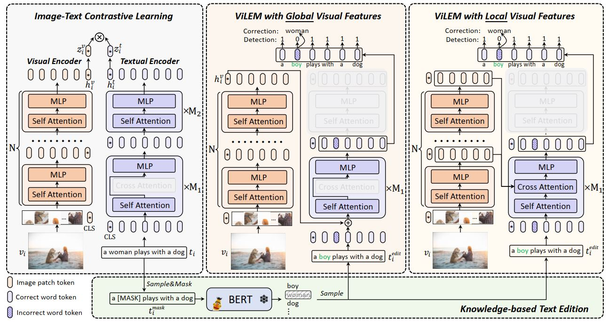

# ViLEM (CVPR2023)

This repository provides an unofficial implementation of the following paper:

> [ViLEM: Visual-Language Error Modeling for Image-Text Retrieval](https://openaccess.thecvf.com/content/CVPR2023/html/Chen_ViLEM_Visual-Language_Error_Modeling_for_Image-Text_Retrieval_CVPR_2023_paper.html)
>
> ***Yuxin Chen, Zongyang Ma, Ziqi Zhang, Zhongang Qi, Chunfeng Yuan, Ying Shan, Bing Li, Weiming Hu, Xiaohu Qie, Jianping Wu\***


## Overview

ViLEM adopt a “dual-encoder” where two encoders are used to extract semantic representation of image, video, and text. 



The novel proxy task, Visual-Language Error Modeling (ViLEM), injects detailed semantic association between images and texts into “dual-encoder” architecture. A multi-granularity interaction framework to perform ViLEM via interacting text features with both global and local image features, which associates local text semantics with both high-level visual context and multi-level local visual information. 

The method surpasses state-of-the-art “dual-encoder” methods by a large margin on the image-text retrieval task and significantly improves discriminativeness to local textual semantics. The model can also generalize well to video-text retrieval.

This repository follows the original paper to reproduce ViLEM and applies the a more advanced vision encoder ([EVA-CLIP](https://github.com/baaivision/EVA/tree/master/EVA-CLIP)).


## Setup

* Prepare a pytorch environment

* install other required packages

  ```
  sh scripts/init.sh
  ```


## Data

* Unzip data.zip to the project folder
* download dataset mentioned in the paper section 4.1. Datasets  


## Training

* pretrain

  ```
  sh scripts/init.sh
  ```

* finetune on coco

  ```
  sh scripts/coco_finetune.sh
  ```

* finetune on flickr

  ```
  sh scripts/filckr_finetune.sh
  ```


## Citation

```
@inproceedings{chen2023vilem,
  title={ViLEM: Visual-Language Error Modeling for Image-Text Retrieval},
  author={Chen, Yuxin and Ma, Zongyang and Zhang, Ziqi and Qi, Zhongang and Yuan, Chunfeng and Shan, Ying and Li, Bing and Hu, Weiming and Qie, Xiaohu and Wu, JianPing},
  booktitle={Proceedings of the IEEE/CVF Conference on Computer Vision and Pattern Recognition},
  pages={11018--11027},
  year={2023}
}
```
